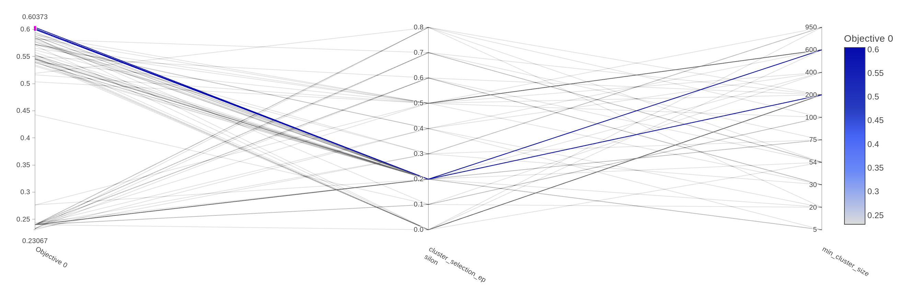
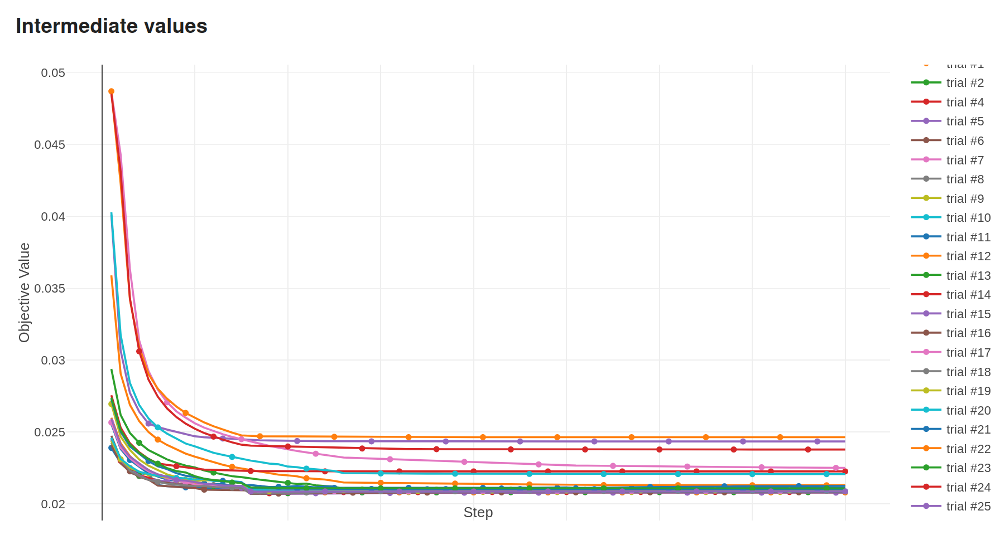
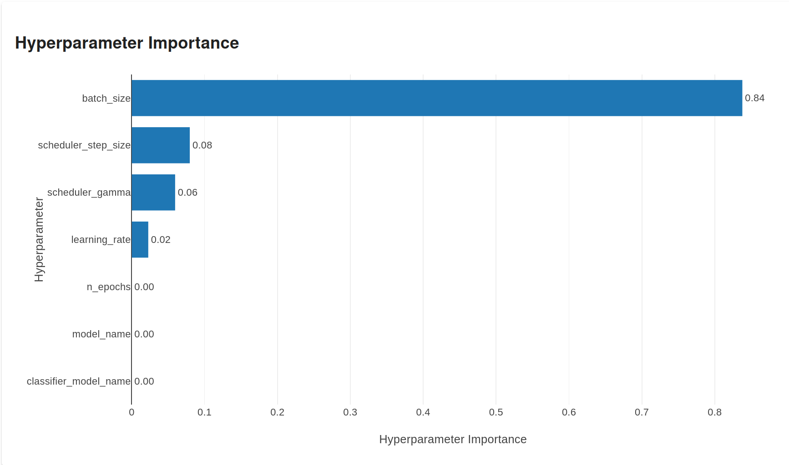
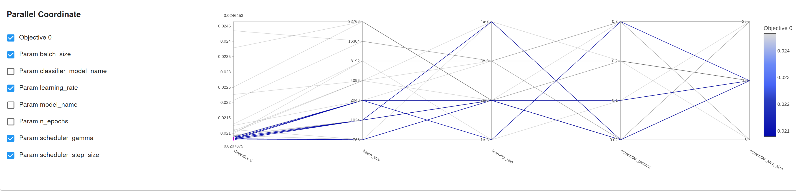

# Hyperparameter Tuning
## TODO- Comprehensive coverage
- [How to locate all fine-tuning studies and Visualize with Optuna Dashboard](#how-to-locate-all-fine-tuning-studies-and-visualize-with-optuna-dashboard)
- [Hyperparameter Tuning for Topic Modeling](#hyperparameter-tuning-for-topic-modeling)
  - [Running Hyperparameter Fine-tuning for Topic Modeling](#running-hyperparameter-fine-tuning-for-topic-modeling)
- [Hyperparameter Tuning for Classifier](#hyperparameter-tuning-for-classifier)
  - [Running Hyperparameter Fine-tuning for Classifier](#running-hyperparameter-fine-tuning-for-classifier)
- [Model Choice Decisions](#model-choice-decisions)
- [Performance Evaluations](#performance-evaluations)


### How to locate all fine-tuning studies and Visualize with Optuna Dashboard
- Navigate to the directory where all Optuna finetuning studies are saved, and list all `.sql` files.

```bash
# assuming you're one level above project root directory
cd ./arxiv_dataset_insights/models/finetuning_studies

# Use dir instead of ls on Windows
ls -l *.sql | awk '{print $9}'
```

##### You should see output like this
```bash
classifier_dataset3_finetuning.sql
classifier_dataset4_finetuning.sql
classifier_dataset5_finetuning.sql
dataset1_finetuning.sql
dataset4_finetuning.sql
dataset5_finetuning.sql
dataset5_partialfit.sql
distilled_model_choice_experiments_dataset5.sql
generate_embeddings.sql
```

##### Select one of the files and launch Optuna Dashboard
```bash
optuna-dashboard sqlite:///classifier_dataset4_finetuning.sql
```

- On successful launch, open link `http://127.0.0.1:8080/dashboard/studies/1` within your browser


### Hyperparameter Tuning for Topic Modeling
#### Running Hyperparameter Fine-tuning for Topic Modeling
  ```bash
   cd <project_root>/apps/bertopic_trainer
   python src/bertopic_finetuning.py ./config/bertopic_finetuning_config_dataset_1.yml 
   ```

- **TODO** get fresh image with appropriate details
  
  The image above shows `cluster_selection_eps of 0.2`, and `min_cluster_size of 200, and 600` contributing
  to `higher coherence score of 0.6 and above`.

### Hyperparameter Tuning for Classifier

##### Running Hyperparameter Fine-tuning for Classifier
  ```bash
  cd <project_root>/apps/classifier/src
  python abstract_classifier_trainer.py ../config/classifier_dataset5_tuning.yml
  ```

##### Intermediate Trial Values


##### Hyperparameter Importance


##### Best Hyperparameters

Image: The image shows few selected (highlighted as blue) trials that contribute to best (lesser the better) objective (BCELoss) scores.


### Model Choice Decisions
### TODO
    - Filter bert models for "Feature Extraction" category
    - Model size
    - Inference time
    - Number of attention heads
    - Arhcitecture (e.g. SBERT)
    - Specific downstream tasks / datasets trained / finetuned on
    - Domain specific models suitable for arxiv dataset feature extraction
    - Model's documentation - model card, performance, intended use, limitations or considerations
    - Experiment and evaluate

    - a suitable NLP model for text classification
        - (use hugging face for that
        - https://huggingface.co/models?library=tf&language=en&license=license:apache-2.0&sort=downloads&search=bert-base )

## Performance Evaluations
- BERTopic and Classifier Evaluations & Results are covered in [this section of ReadMe.md file](ReadMe.md#running-classifier-evaluations)