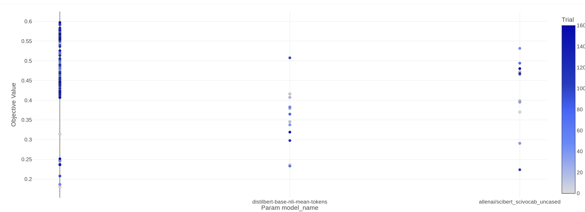

# Hyperparameter Tuning

## Comprehensive coverage

- [How to locate all fine-tuning studies and Visualize with Optuna Dashboard](#how-to-locate-all-fine-tuning-studies-and-visualize-with-optuna-dashboard)
- [Hyperparameter Tuning for Topic Modeling](#hyperparameter-tuning-for-topic-modeling)
    - [Running Hyperparameter Fine-tuning for Topic Modeling](#running-hyperparameter-fine-tuning-for-topic-modeling)
- [Hyperparameter Tuning for Classifier](#hyperparameter-tuning-for-classifier)
    - [Running Hyperparameter Fine-tuning for Classifier](#running-hyperparameter-fine-tuning-for-classifier)
- [Model Choice Decisions](#model-choice-decisions)
- [Selecting the Optimal Number of Categories](#selecting-the-optimal-number-of-categories)
- [Performance Evaluations](#performance-evaluations)

## How to locate all fine-tuning studies and Visualize with Optuna Dashboard

- Navigate to the directory where all Optuna finetuning studies are saved, and list all `.sql` files.

```bash
# assuming you're one level above project root directory
cd ./arxiv_dataset_insights/models/finetuning_studies

# Use dir instead of ls on Windows
ls -l *.sql | awk '{print $9}'
```

##### You should see output like this

```bash
classifier_dataset3_finetuning.sql
classifier_dataset4_finetuning.sql
classifier_dataset5_finetuning.sql
dataset1_finetuning.sql
dataset4_finetuning.sql
dataset5_finetuning.sql
dataset5_partialfit.sql
distilled_model_choice_experiments_dataset5.sql
generate_embeddings.sql
```

##### Select one of the files and launch Optuna Dashboard

```bash
optuna-dashboard sqlite:///classifier_dataset4_finetuning.sql
```

- On successful launch, open link `http://127.0.0.1:8080/dashboard/studies/1` within your browser

## Hyperparameter Tuning for Topic Modeling

#### Running Hyperparameter Fine-tuning for Topic Modeling

  ```bash
   cd <project_root>/apps/bertopic_trainer
   python src/bertopic_finetuning.py ./config/bertopic_finetuning_config_dataset_1.yml 
   ```

- 
  The image above shows `cluster_selection_eps of 0.2`, and `min_cluster_size of 200, and 600` contributing
  to `higher coherence score of 0.6 and above`.

### Hyperparameter Tuning for Classifier

##### Running Hyperparameter Fine-tuning for Classifier

  ```bash
  cd <project_root>/apps/classifier/src
  python abstract_classifier_trainer.py ../config/classifier_dataset5_tuning.yml
  ```

##### Intermediate Trial Values


##### Hyperparameter Importance


##### Best Hyperparameters


Image: The image shows few selected (highlighted as blue) trials that contribute to best (lesser the better) objective (
BCELoss) scores.

## Model Choice Decisions

- For model selection, I selected the following 5 models for hyperparameter tuning.
    1. `sentence-transformers/distilroberta-base-paraphrase-v1`
    1. `sentence-transformers/stsb-distilroberta-base-v2`
    1. `sentence-transformers/distilbert-base-nli-stsb-quora-ranking`
    1. `distilbert-base-nli-mean-tokens`
    1. `allenai/scibert_scivocab_uncased`
- The notion behind choosing these models for study were among (but not limited to) the following:
    - `Smaller models size, less parameters`: Distilled BERT and RoBERTa models have approx 30M parameters as compared
      to the original
      BERT or RoBERTa with 150M to 300M+ parameters. This not only helped me do faster inference, and save
      significant time on computations, but also allowed me to run experiments in less amount of time and
      computational resources.
    - `Underlying Task and Dataset the model is finetuned on`:
        - The type of the downstream task for which the model is finetuned
          for was a crucial aspect. During literature study, I covered that when it comes to comparing similarity
          between
          sentences, BERT isn't as efficient. So the researchers of SBERT came up with Siamese architecture based
          BERT fine-tuning on NLI task.
        - Similarly, I also decided to try models tuned for `paraphrase` task as per Reimers et. al.[3].
        - Finding a distilled model fine-tuned on Arxiv or similar whitepaper dataset which covers such a
          wider variety of domains would have been an ideal choice. Although, Wikipedia dataset is one of such
          that comes handy for generalization across multiple domains. And for a reason, that Wikipedia is still well
          written
          citing to authentic references, often reviewed by experts makes it an ideal choice for this task.
        - Reimers et. al. in [3] fine-tune distilroberta model on paraphrase task mainly derived from Wikipedia, which
          they
          claim performs the best across all of their.
        - Further to that, even though the current task dataset is English only. Reimers et. al.'s their goal is also to
          demonstrate
          the effectiveness of their approach across 50+ languages while also bringing sentences from multiple languages
          into
          the same vector space after translation.
    - `Optimal finetuing of the baseline architecture`:
        - The research on RoBERTa claims that the original BERT model wasn't trained
          to its full potential, leaving much more room for improvements, and hence, researchers came up with RoBERTa.
        - RoBERTa is still BERT architecture with most of the parameters exactly the same.
        - It has lightly different training methodology, which allows model to learn on 512 token length long sequences
          across the whole training process.
        - Which grabs my attention, creating curiosity to test effect of that different training strategy. So, I decided
          to add RoBERTa based distilled models to my study as well.

- Among four models, I can endorse the findings of Reimers et. al. [3] where they say - "Even though SBERT-nli-stsb was
  trained
  on the STSbenchmark train set, I observed the best performance by SBERT-paraphrase, which was not trained with any STS
  dataset.
  Instead, it was trained on a large and broad paraphrase corpus, mainly derived from Wikipedia,
  which generalizes well to various topics". My hyperparameter tuning results explain why.

- The following results are from Optuna study storage file - `distilled_model_choice_experiments_dataset5.sql`
    - The following image showing `distilroberta-base-paraphrase-v1`, and `distilbert-base-nli-mean-tokens` contributing
      to the higher
      coherence score. Optuna study name `distilled_model_selection_sample_dataset5`.
      
    - Another image from study `distilled_model_selection_sample_dataset5_2` showing that `paraphrase` model still
      outperforms in coherence score when compared with
      yet another model fine-tuned on Scientific Papers - `allenai\scibert_scivocab_uncased`. On the left
      is `paraphrase` model
      from Reimers et. al. [3] which not only contributes to high coherence score, but also significantly outperforms
      other models.
    - 
    - Yet another study named `distilled_model_selection_sample_dataset5_3` performed to break performance ties between
      models
      `distilbert-base-nli-mean-tokens` and `distilroberta-base-paraphrase-v1`. This image shows that the
      later `paraphrase` model
      has consistently contributed to all top scores, and not a single score among the top scores were attributed
      to `distilbert-base-nli-mean-tokens` model.
      
    - These findings helped me choose `paraphrase` model for further fine-tuning of BERTopic's key intermediate
      pipelines,
      such as dimensionality reduction, and hierarchical clustering.

## Selecting the Optimal Number of Categories

- The following results are from `distilled_model_choice_experiments_dataset5.sql` Optuna Study storage file.
- As I used only one metric to evaluate topic model quality - Coherence Score, the process to choose optimal number of
  topics
  assumes optimal number of topics to be ones that for which consistent high scores are reported across multiple trials
  and studies.
- In this Image from study named `distilled_model_selection_sample_dataset5_3`, I saw `1200 nr_topics` has been
  confirmed as a contributor to higher Coherence Score across a few trials, with 800 and 15 following in scores
  
- Important observation I made across several studies is Coherence Score peaks both nearby 15, and 800, 1200, and
  reduces
  in between of 15 and 800, and after 1200.
- As I visited Optuna Study storage file named `dataset5_finetuning.sql`, I noted following observations
- 1200 nr_topics consistently contributed to the highest Coherence Scores.
- Reproducing the results even after using all the exact same hyperparameter values as among best study trials didn't help
  completely reproduce what I saw in best studies as reported in studies covered in lines above.
- The best parameters combination produced Coherence Score of 0.66421, although, using the exact same hyperparameters across
  multiple trials only resulted in maximum achievement of Coherence Score of 0.6037.
- This issue with reproduction could have to do something with processing done on GPU, and hence, some random initialization.
- **[TODO for me]** I should set the GPU seed across all the frameworks that access GPU during hyperparameter tuning and final training.
  And then see if the reproduction issue still persists or not.

## Performance Evaluations

- BERTopic and Classifier Evaluations & Results are covered
  in [this section of ReadMe.md file](ReadMe.md#running-classifier-evaluations)