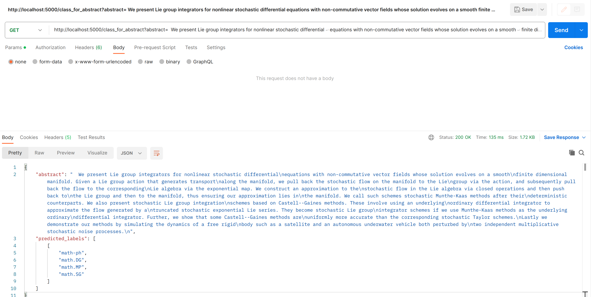

# Exploring Unsupervised Learning with Arxiv Dataset Abstracts

## Documentation Navigation

- `ReadMe.md` (you are here)
    - Covers details on Installing requirements, and initializing dataset.
    - Then redirects you to `ResearchSteps.md` file.
- `ResearchSteps.md`
    - Covers all steps from literature review, data preprocessing, EDA and insights.
    - Then redirects you to `HyperparameterTuning.md` file.
- `HyperparameterTuning.md`
    - Covers Hyperparameters Tuning in details, covering several studies and including decisions to continue with
      certain hyperparameters, for both Topic Model and Classifier.
    - Then redirects you back to this page to view Evaluations details, where later sections continue with inference
      app, conclusions, and more.

## Project Structure and Directories

- The repository top level has `apps`, `logs`, `models`, `dataset`, `resources`, and some essential files including this
  documentation.
    - `apps` is where trainers, and services are kept
        - `bertopic_trainer` - used to fine-tune and train BERTopic models
        - `classifier` - used to fine-tune and train a supervised classifier
        - `inference_service` - used for classifier inference
        - `init_database` - service to write all arxiv documents to MongoDB. Not fully utilized used at the moment.
        - `notebooks` - additional jupyter notebooks
    - `models` contains MultilabelBinarizer, and best_model.bin files under respective finetuning_studies. (Only 2 saved
      to save repo size)
    - `dataset` this is not included, but is a placeholder for arxiv original dataset file, and corresponding dataset
      splits that are created as part of this study.
    - `resources` contains images used within documentation.

- Directory Tree Structure is as follows (skipping individual files):
    <pre>
      arxiv_dataset_insights (project_root)
      ├── apps
      │ ├── bertopic_trainer
      │ │ ├── config
      │ │ ├── logs
      │ │ └── src
      │ ├── classifier
      │ │ ├── config
      │ │ ├── logs
      │ │ └── src
      │ ├── inference_service
      │ │ ├── config
      │ │ ├── logs
      │ │ └── src
      │ ├── init_database
      │ │ └── src
      │ └── notebooks
      │ └── src
      ├── dataset **(not included)**
      │ ├── cache_dir
      │ └── parquet
      ├── logs
      ├── models
      │ └── finetuning_studies
      │ ├── classifier_dataset4_study1
      │ ├── distilled_model_selection_sample_dataset5_3
      └── resources
    </pre>

### Files Included / Not Included in this repository

#### Included

- Python source code files.
- models directory with essential models
    - Best models used for inference.
    - Best models for which evaluation scores are reported.
    - MultiLabelBinarier file.
- All notebook files, including the partially abandoned ones.
- Essential log files for review.
- Optuna study storage files - ending with .sql extension.
- requirements.txt files.
- .gitignore file.
- Dockerfile's and docker-compose.yml file.
- Documentation files - ReadMe.md, ResearchSteps.md, HyperparameterTuning.md

#### Not Included

- Embeddings files ending with .npy extensions are not included, but they are generated from scratch
  if they don't exist.
    - They are only helpful if training / fine-tuning from scratch. Inference directly calls transformers model.
- Dataset files - the original arxiv dataset json file, and 5 datasets with different split ratios that I generated
  are not included. Mainly the reason being, the files are too big.
  Although, [EDA Notebook in this section](ResearchSteps.md#eda-and-creating-train-validation-test-splits)
  can be used to generate datasets. Please note that, your results could differ due to random sampling from each
  category.

<br>

## All Steps

- [Description](#description)
- [Assumed Requirements](#assumed-requirements)
- [Initialize Dataset](#steps-to-initialize-dataset)
- [Research Steps](#research-steps)
- [Running Classifier Evaluations](#running-classifier-evaluations)
    - [Evaluator YAML Configuration](#evaluator-yaml-configuration)
    - [Key YAML Elements Explained](#key-yaml-elements-explained)
- [Inference App / Endpoint](#inference-app--endpoint)
- [Conclusions](#conclusions)
- [Issues Faced](#issues-faced)

## Description

Objectives as part of this study are to find Optimal Number of Categories, and then build a Classifier
to classify Arxiv research articles into predefined categories, while both objectives focus only on using paper
abstracts from Arxiv dataset for feature extraction.

## Assumed Requirements

- All the requirements to run the corresponding submodules are provided within requirements.txt file at the root of
  that module.
    - Hence, consider creating python virtual environment and install all the requirements from requirements.txt file.
- **[skip this step]** Docker is installed, and appropriate permissions are granted for running this project.
    - Plan to use docker for everything was dropped because I couldn't fully figure out how to access GPU from docker
      instance.
    - Using things through docker containers would work, but not using GPU would slow things down significantly.

## Steps to initialize dataset

1. Download and unzip dataset and place it in `dataset` directory
    - Dataset url
   ```bash
   https://www.kaggle.com/datasets/Cornell-University/arxiv?resource=download
   ```
    - Place `arxiv-metadata-oai-snapshot.json` file in `dataset` directory

1. Initialize Mongodb collection, so that it's easy to access small portion of dataset as needed rather than loading
   everything in memory.
    - Run init_database service, wait for it to finish
   ```bash
    docker-compose up init_database
    ```

## Research Steps

Research steps are comprehensively covered in file [ResearchSteps.md](ResearchSteps.md)
Don't worry, you'll be redirected to section after this one.

## Running Classifier Evaluations

- Classifier Evaluator program is available at location - `<project_root>/apps/classifier/src/classifier_evaluator.py`
- Evaluator uses `yaml` config file

- Here's how you run the example evaluations

```bash
# example for dataset4
# assuming you are at the project root which is inside <arxiv_dataset_insights> directory
cd apps/classifier/src/
python classifier_evaluator.py ../config/evaluator_dataset5.yml
```

- Some evaluator results can be seen in these log files:
    - Evaluations for dataset 4 - `./apps/classifier/src/logs/classifier_evaluator_dataset4-1762023-195325.txt`
    - Evaluations for dataset 5 - `./apps/classifier/src/logs/classifier_evaluator_dataset5-1762023-195732.txt`

#### Evaluator YAML Configuration

```yaml
logging_dir: "../logs"
logfile_name: "classifier_evaluator_dataset5"
logging_level: "INFO"

dataset_path: "../../../dataset"
models_path: "../../../models"

# This indicates the model chosen for evaluations is the best
# model saved during specified Optuna hyperparameter tuning study.
optuna_study_name: "classifier_dataset4_study1"

dataset_index: 5

# model settings
label_transformer: "multilabel_binarizer.pkl"
transformer_model_name: 'sentence-transformers/distilroberta-base-paraphrase-v1'
num_classes: 176
input_size: 768

batch_size: 1024
```

#### Key YAML Elements Explained

- `optuna_study_name`: This indicates the model chosen for evaluations is the best
  model saved during specified Optuna hyperparameter tuning study.
- `dataset_index` - Checkout section [Dataset Creation](#dataset-creation) on how datasets are created.
- `label_transformer` - name of label_transformer that is present with the same name under `models_path` directory.
  This model is of type `sklearn.preprocessing.MultiLabelBinarizer` and supports 176 unique classes extracted
  from `categories` from the original arxiv dataset.

#### Classifier Evaluation Results

The best model selected for this test was from the following Optuna study:

- Optuna storage file: `classifier_dataset4_finetuning.sql`
- Study name: `classifier_dataset4_study1`
- Best Trial: `#15`
- Trained on `Dataset 4 train split`
- Binary Crossentropy Loss reported on validation set during trial - `0.02078`

##### Dataset 4

|       Threshold       | Top-1-Overlap Accuracy |
|:---------------------:|:----------------------:|
|   <th> Train </th>    |                        |
|         0.05          |         0.9570         |
|          0.1          |         0.9239         |
|          0.2          |         0.8627         |
|          0.3          |         0.8017         |
| <th> Validation </th> |                        |
|         0.05          |         0.9434         |
|          0.1          |         0.9044         |
|          0.2          |         0.8369         |
|          0.3          |         0.7737         |
|    <th> Test </th>    |                        |
|         0.05          |         0.9432         |
|          0.1          |         0.9044         |
|          0.2          |         0.8373         |
|          0.3          |         0.7738         |

<br>

##### Dataset 5

These results on based on straight inference on all splits using the same best model as stated above.

|             Threshold             | Top-1-Overlap Accuracy |
|:---------------------------------:|:----------------------:|
| <th> Train (inference only) </th> |                        |
|               0.05                |         0.9568         |
|                0.1                |         0.9236         |
|                0.2                |         0.8632         |
|                0.3                |         0.8016         |
|       <th> Validation </th>       |                        |
|               0.05                |         0.9533         |
|                0.1                |         0.9185         |
|                0.2                |         0.8532         |
|                0.3                |         0.7897         |
|          <th> Test </th>          |                        |
|               0.05                |         0.9527         |
|                0.1                |         0.9178         |
|                0.2                |         0.8531         |
|                0.3                |         0.7919         |

<br>

#### Topic Modeling Evaluation Results

The best model selected for this test was from the following Optuna study:

- Optuna storage file: `distilled_model_choice_experiments_dataset5.sql`
- Study name: `distilled_model_selection_sample_dataset5_3`
- `trial #74`
- Trained on Dataset 5
- Coherence Score reported on validation set during trial - 0.6642

##### Dataset 4

|   Split    | Coherence Score |
|:----------:|:---------------:|
|   train    |     0.6228      |
| validation |     0.5875      |
|    test    |     0.6066      | 

<br>

##### Dataset 5

|   Split    | Coherence Score |
|:----------:|:---------------:|
|   train    |     0.5802      |
| validation |     0.5678      |
|    test    |     0.5569      | 

- For the best trial with coherence score of 0.6642 on dataset 5 validation split, `nr_topics` was set to `1200`,
  although the model only returns 7 topics.
- While, that's true about `nr_topics`, the same best model saved from `trial #74` still reported Coherence Score of
  0.5678, contrasting 0.6642 reported on the same split during evaluation after training, which reconfirms the
  reproducibility issues.

## Inference App / Endpoint

- Inference app is served using Flask.
    - Key endpoint served is `class_for_abstract`, where body should pass argument `abstract` key with abstract
      string as a value.
    - It can be accessed from the browser or Postman app, or can be called through programs using the REST API.
-
- Running Inference App locally using python

```bash
cd <project_root>/apps/inference_service/src
python inference_app.py ../config/inference_config.yml
```

- Sending Request through Postman or from web browser

```bash
# you can use this example
http://localhost:5000/class_for_abstract?abstract=  A fully differential calculation in perturbative quantum chromodynamics is
presented for the production of massive photon pairs at hadron colliders. All
next-to-leading order perturbative contributions from quark-antiquark,
gluon-(anti)quark, and gluon-gluon subprocesses are included, as well as
all-orders resummation of initial-state gluon radiation valid at
next-to-next-to-leading logarithmic accuracy. The region of phase space is
specified in which the calculation is most reliable. Good agreement is
demonstrated with data from the Fermilab Tevatron, and predictions are made for
more detailed tests with CDF and DO data. Predictions are shown for
distributions of diphoton pairs produced at the energy of the Large Hadron
Collider (LHC). Distributions of the diphoton pairs from the decay of a Higgs
boson are contrasted with those produced from QCD processes at the LHC, showing
that enhanced sensitivity to the signal can be obtained with judicious
selection of events.
```

- The image shows successful completion of request within Postman app along with appropriate predicted_labels values.
  

- Running inference app using `docker-compose`
    ```bash
    cd <project_root>
    docker-compose up -d inference_app
    ```
    - Once docker container is up and running, you try the same endpoint as stated above.

## Conclusions

- Although, I selected 1200 as optimal number of categories, the reproduction attempts resulted in almost 6% reduction
  in Coherence Score, which was the only metric used for best hyperparameters selection.
- As Coherence scores consistently peaked for `number of categories` around 15, 800, and 1200, they consistently stayed
  below certain scores for all other test ranges.
    - Based on [Top level unique categories study from EDA](ResearchSteps.md#top-level-unique-categories), the number 15
      as optimal number of categories makes sense for broader level of categories. Although, there's clear opportunity
      for further granular level fine-tuning within that local range.
    - Further granular level fine-tuning is also necessary within 800-1200 local range, although, I didn't focus on ways
      to justify and well distinguish the presence of number of categories as high as 800 to 1200. And I don't think
      topic modeling would be any appropriate way to explain it, specifically not BERTopic, which only merges top N
      words to create a name for a topic. One would need to thoroughly explain what's in them concept wise, perhaps
      that's where summarization based approaches would help.
- Data Exploration shows tree hierarchies of categories, where hierarchies aren't followed consistently across category
  labels for all samples. And hence signalling that hierarchical topic modeling may not be the only one among possible
  best approaches for this problem.
- Paraphrase model outperformed every other model in terms of Cohere Score. That not only demonstrates the power of
  paraphrasing model of capturing the finer concept-level details, but also the power of bringing similar words from
  multiple languages on similar vector space, while the fine-tuning was done on majorly Wikipedia-based dataset.
    - There are lots of good things contributing positively for this model, and hence, further deeper study into every
      aspect could reveal interesting details and insights about each of them.
- BERTopic is an amazingly designed framework that attempts to combine the best of Embeddings world, Dimensionality
  Reduction, and Clustering.
    - Although, the technique still brings it all down to the traditional tf-idf level. Even if they reference it as
      class / cluster
      level tf-idf, (c-tf-idf), the contextual word meanings are almost ignored at the top level by extracting the
      document level embeddings. And then further they are ignored again at the bottom level by simply using Count
      Vectorizer and c-tf-idf.
    - Further, by initially just extracting document level embeddings, and then combining all documents within the same
      cluster into a single document, BERTopic gives up on certain finer level details such as `Word-level Granularity`,
      `Localized Topic Specificity`, `Individual Word Interpretability`, and `Document Level Context`. Such details are
      rather well addressed by traditional topic modeling techniques such as LDA.
    - These missing aspects are also very crucial for hierarchical topic modeling, and hence, could limit our ability to
      extensively study hierarchies in Arxiv dataset abstracts.
- In order to improve the pace of research in contextual embeddings for bigger datasets, libraries like cuML that
  offer GPU based implementations for key algorithms of Dimensionality Reduction, and Clustering need active support for
  processing data in batches rather than reserving the GPU memory until the end of algorithm execution. Currently, in my
  opinion, these libraries aren't ready for bigger datasets, and hence, custom algorithms need to be implemented on top
  of existing implementations to explicitly deal with issues such
  as `Cluster Fragmentation`, `Instability`, `Concept Drift` etc. depending on which algorithms are used.
- Due to limitations with Dimensionality Reduction and Clustering algorithms excessive GPU memory footprint, given the
  size of bigger datasets.
  I only used dataset 5, which is only 5% of the original data within each split. Hence, even though I have used
  stratified data selection strategy to select data across all unique 176 known categories, the chosen optimal number of
  categories might differ for datasets 1 to 4, which comprise 40% to as big as 80% data of original Arxiv dataset.
- Classifier shows great accuracy scores when considering Top-1-Overlapping labels accuracy at lower probability
  thresholds. Although that accuracy metric starts dropping as we move up the number of words overlap to 2 and beyond.
  Part of the reason mainly being the inconsistent nature of level associations to category labels as shown
  in [EDA](ResearchSteps.md#label-associations). Although, it wasn't thoroughly studied why such inconsistencies existed
  in the first place, perhaps due to the complex nature of true topic association itself, which again raises question on
  hierarchical topic allocation being the only possible solution.
- Final big issue with BERTopic is that the paper says they reduce topics down to the value specified by `nr_topics`
  argument. In contrast, the number of topics returned were nowhere closer to the `nr_topics` value, and rather
  were significantly smaller for all of my studies.
- Even though I'm concluding BERTopic as a failed study due to several issues, the steps until HDBSCAN clustering are
  still reliable, and hence, I can pick up output from clustering as one of the possible inputs for my own study on
  contextual topic modeling.

<br>

## Issues faced

- Installation related issues
- Issue with mounting GPU to docker container **[unresolved]**
- Issues with extracting Embeddings for Clustering, the model, size, and time limit considerations, computations limits
  on local machine
- Issues while installing cuML library
- Issues faced while trying evaluation metrics from OCTIS
- GPU memory leaks and inability to proceed with fine-tuning of larger datasets I selected - datasets 1, 2, 3, 4
    - Although I did manage to train 1 model on dataset 1, for which, the training data is approx 40% of the original
      dataset.
        - That too was achieved by only reducing precision of embeddings to float16.
        - Clearing GPU context memory after intermediate steps of dimensionality reduction, and clustering, but not as
          much for bigger datasets.
- Difficulty in reproducing BERTopic results, at least in my case. This is potentially due to using GPU based
  computations across 80% processing.
