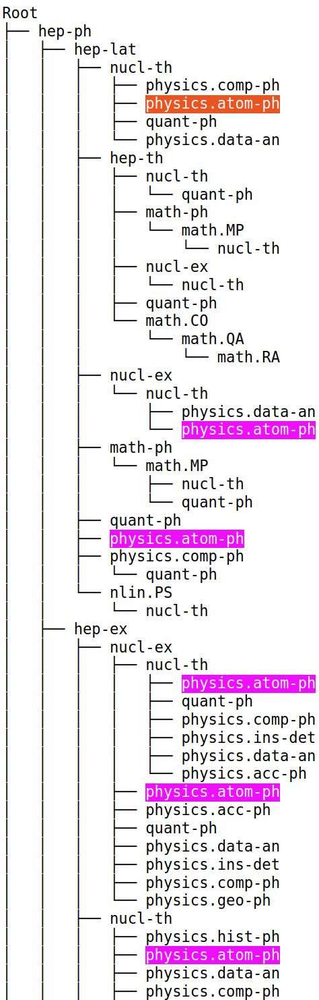

## Use abstracts for classification and subject categories for class association.

## Research Steps

1. [Literature Review](#literature-review)
    1. [Top Articles / Papers / Implementations Referred](#top-articles--papers--implementations-referred)
1. [Data Preprocessing](#data-preprocessing)
1. [EDA and Creating Train, Validation, Test splits](#eda-and-creating-train-validation-test-splits)
    1. [Label Associations](#label-associations)
    1. [Text Lengths and Assumptions for Outliers](#text-lengths-and-assumptions-for-outliers)
    1. [Creating Datasets for Training, Validation, and Testing Purposes](#creating-datasets-for-training-validation-and-testing-purposes)
1. [Hyperparameter Tuning](#hyperparameter-tuning)

## Literature Review

- Classifying documents into unknown number of classes and figuring out the optimal number of classes is majorly
  solved using these approaches:
    1. Clustering
    2. Topic Modeling
- The issue with Clustering based approaches is it doesn't take document topic prior and word topic prior, which is
  addressed by topic modeling approaches such as LDA.
- While Topic Modeling algorithms such as LDA account for word and document topic prior's, they still rely on the
  traditional
  CountVectorizer, or TF-IDF based approaches yet using the smaller dictionary with limited vocabulary. The
  preprocessing logic
  thus relies on removing stop-words, followed by either stemming or lemmatization for the remaining tokens, so that
  most of the similar
  tokens, irregardless of the context, are accounted for. So that having brought all words to their lexical base forms,
  they contribute
  to the overall term frequency as the same word.
- Although, I'd give up on contextual meaning of word by just stemming or lemmatizing them. Which can be overcome by
  utilizing
  the modern Deep Learning architectures such as Transformers based models. Transformers allow us to extract mainly two
  types of representations:
    1. Token Level Representation - Different embedding for every word (depending on surrounding context).
    2. Document Level Representation - Pooling layer representation (average of all word representations for a given
       document).
- We can either go heavy and try clustering individual token level representations for all documents. Which is
  unexplored in our current study.
- Or I can simply go with option 2 - Clustering Document Level Representation.
- Either way, I'd still end up in a challenge of selecting top words for topics, or having too many topics, and face
  challenge of reducing / merging
  similar topics.
- Saha et. al. in [4] has demonstrated use of KMeans, DBSCAN, and HDBSCAN clustering algorithms on BERT-Average,
  BERT-CLS, and Word2Vec embeddings
  which is evaluated across metrics such as Silhouette Score, Adjusted Rand Index Score, Purity Score etc.
- The study demonstrates that BERT embeddings mostly best the Word2Vec embeddings across most of the
  clustering techniques and evaluation metrics.
- Although, their study is fairly limited to just single dataset comprised of consumer electronics from one brand.
- Further to that, it also becomes crucial on which model I should use to extract embeddings. Jinghui et. al. in [2]
  introduced
  SBERT where they build Siamese network on top of Transformer models, and finetune the network for sentence similarity
  task,
  making it much more faster and easier to find similar sentence pairs.
- Although, I still face computational challenges trying to extract embeddings from SBERT model variants given the size
  of the arxiv dataset,
  hence, I went further exploring options to reduce number of parameters used by the model. Which brings us to Reimers
  et. al. [3],
  where they further expand SBERT models by doing the following:
    1. Produce Distilled Models (significantly reduced number of parameters)
    2. Finetune models on Multiple Languages to bring same words from multiple languages in the same vector space.
- Additionally, for model selection, I selected the following 4 models for hyperparameter tuning, among which, I can
  endorse
  the findings of Reimers et. al. where they say - "Even though SBERT-nli-stsb was trained on the STSbenchmark train
  set,
  we observed the best performance by SBERT-paraphrase, which was not trained with any STS dataset.
  Instead, it was trained on a large and broad paraphrase corpus, mainly derived from Wikipedia, which generalizes well
  to various topics."
    1. `sentence-transformers/distilroberta-base-paraphrase-v1`
    1. `sentence-transformers/stsb-distilroberta-base-v2`
    1. `sentence-transformers/distilbert-base-nli-stsb-quora-ranking`
    1. `distilbert-base-nli-mean-tokens`
- As a result of our hyperparameter tuning for model selection, `sentence-transformers/distilroberta-base-paraphrase-v1`
  indeed
  topped our list, and hence, the further hyperparameter tuning was done using the same model.
- The key implementation I used for topic modeling is from offered by Grootendorst et. al. [1] - BERTopic. The framework
  offers the best of all the worlds
  by combining SBERT embeddings, whose dimensionality is then reduced by using UMAP or any other supported
  Dimensionality Reduction technique. The HDBSCAN algorithm
  then creates hierarchical clusters, where for each cluster, all documents within the same cluster are rather treated
  as a single document for further c-tf-idf vectorization.
- The framework not only allows us to use any swappable components (Embedding model, Dimensionality Reduction,
  Clustering and Topic Reduction) but it also offers
  some tools for interpreting and visualizing topics. Hence, in our study, I chose to test this framework with
  combinations of appropriate hyperparameters
  selected based on dataset EDA and knowledge referenced from other cited sources.
- In this study, I use BERTopic Framework for creating topic model for classifying abstracts into unknown number of
  topics.
- Further, the original dataset provides list of category associations for each document. So I trained Multi Label
  Classifier using the embeddings extracted from best model I selected during Topic Modeling.

### Top articles / papers / implementations referred:

- #### 1. BERTopic: Neural topic modeling with a class-based TF-IDF procedure (https://arxiv.org/abs/2203.05794)
    - Library Documentation - https://maartengr.github.io/BERTopic/getting_started/quickstart/quickstart.html
- #### 2. Sentence-BERT: Sentence Embeddings using Siamese BERT-Networks (https://arxiv.org/pdf/1908.10084.pdf)
    - Library Documentation - https://github.com/UKPLab/sentence-transformers
- #### 3. Making Monolingual Sentence Embeddings Multilingual using Knowledge Distillation (https://arxiv.org/abs/2004.09813)
- #### 4. Influence of various text embeddings on clustering performance in NLP (https://arxiv.org/pdf/2305.03144.pdf)

## Data Preprocessing

- The input text is the abstract of scientific papers. So, I'd assume use of stop words serves meaningful purpose, and
  therefore shouldn't be removed before inference from transformer models. Although, I remove stop words when
  CountVectorizer is called.
  And the list of stopwords is used from Gensim library - `gensim.parsing.preprocessing.STOPWORDS`

- Basic cleaning - I only performed basic text cleaning as follows:
    - Replace `\n`'s with a space.
    - Add `[SEP]` token when sentence is finished with full stop, because pretrained tokenizers don't do it themselves,
      and hence, always miss the special token `[SEP]`, which has impact on the final representation of the document.
        - Although, in initial experiment, the downstream model I ended up using
          is `sentence-transformers/distilroberta-base-paraphrase-v1`.
        - And since `RoBERTa` model rather uses `<sep>` as a separator token, and my preprocessed data still
          contains `[SEP]` tokens, `sep` is going
          to exist across all the documents as a noise.
        - Hence, there's a risk of having a lot of similarity across all the documents just because of this mistake.
        - **[TODO for myself]** I'll fix this in coming iterations. I'm just choosing to continue as is because I have
          already
          generated data splits, and corresponding document embeddings for abstracts.
          and I don't want to spend anymore time re-doing all that in initial iteration.

- Because I have chosen to work with BERTopic, which, after extracting
  embeddings from transformer models, the only place where original text is then used is in c-tfidf model.
  Since, c-tfidf model still uses traditional CountVectorizer and TF-IDF Transformer on top of it, where contextual word
  embeddings from
  transformer model aren't used to compute similarities. And hence, it's necessary to perform lemmatization on all
  documents, so that words with similar base lexical meaning aren't treated differently.
  In this implementation, I only performed offline lemmatization and ensure they are used only after the for c-tf-idf
  step, while the transformer embeddings are generated
  using the full abstract text with basic cleaning as covered in previous step.

- The WordPiece tokenizer of BERT would still make sure to assign appropriate token to almost every possible token in
  the
  corpus, therefore, there might is no need for us to handle OOV words explicitly. Except, where I started seeing some
  irrelevant words / symbols
  making up the part of the topic labels. Then I can consider removing such symbols / tokens.

## EDA and Creating Train, Validation, Test splits

### EDA

#### Label Associations

- In EDA as I explored the labels in tree hierarchy fashion. We can see that `physics.atom-ph` is associated
  across many different top level labels such as - `nucl-th`, `nucl-ex`, `hep-lat`. Or even labels at the parent level
  to `physics.atom-ph` don't follow consistent hierarchy either. Which does offers me insights that hierarchical topic /
  label
  association seems alright, but may not be the best / complete solution to the problem at hand.
  

#### Top Level Unique Categories
- Among 176 unique categories, I saw naming pattern.
- These are some of the examples from 176 unique categories - 'quant-ph', 'physics.flu-dyn', 'acc-phys', 'ao-sci', '
  math.KT', 'cs.CE', 'q-fin.PM', 'cs.CV', 'cs.MS', 'math.GM'
- As per the [Arxiv Category Taxonomies](https://arxiv.org/category_taxonomy), even
  though `cs.CE`, `cs.CV`, `cs.MS`, belong to `Computational Engineering`, `Computer Vision`, and `Mathematical Software`
  respectively, they still fall under `cs` - `Computer Science` as their major category.
- And hence, in order to go towards the broader level of categories, I split the names by any symbols, and took first word,
  to land at 31 unique broader level categories, or 32 if I rather add `q-bio`, and `q-fin` separately, and remove `q`.
  - Although, issue with this is e.g. if we consider `quant` as top level category, here are two examples where
  `quant` appears at the beginning of one - `quant-ph`, and in the middle of the other one `cond-mat.quant-gas`.
- Going through [Arxiv's Online Taxonomies](https://arxiv.org/category_taxonomy) 2nd broad level categories, there are about
  13 or such 2nd level categories. Although, they don't have everything covered in their taxonomy.
- Some examples of missing categories from [Arxiv'x Online Taxonomies](https://arxiv.org/category_taxonomy) are `patt`, `solv`, `adap`, `funct`, `bayes` etc.
- So overall this study suggests that the range between 7 and 30 categories as a broad level categories exploration exercise makes sense.
- Although, if we want to dive into concept level details, we need to go higher in range for finding the optimal number of topics,
  hence, I tried ranges all the way up to 1500 and beyond in my experiments.

#### Text Lengths and Assumptions for Outliers
- Outlier articles are 22 where the way they were treated as was based on the word count for their abstracts > 500
  words (this is before tokenization).
    - Pretrained BERT model was only trained on 512 tokens for single sequence
    - 99.99% articles in the dataset have abstracts less than 500 tokens
    - Therefore, considering using advanced techniques to accommodate for sequence length longer than 512 for
      0.000009742% of articles would be a step too far for this exercise.
    - Hence, skipping these 22 articles from initial training, test, validation datasets.
    - Although, we can include this as a separate outlier dataset, where we do the inference using only initial N number
      of words and cutting off threshold at 512 tokens max.

- Also treating 25th percentile of 25th percentile of word counts, where first 25th percentile was around 48 words, and
  25th percentile of that was 27 words.
    - This would also help us avoid too much sparsity in embeddings.
    - Most of the abstracts in this threshold were just single sentence abstracts, with extremes being single word.
    - Some of them were invitations for papers, which are not really abstracts.

### Creating Datasets for Training, Validation, and Testing Purposes

- As I found 176 unique categories, selecting some samples from each category was one of the straight forward ways to
  ensure
  stratification across all categories for all splits - train, validation, and test.
- The following steps state scripts, and configurations used to create 5 datasets.
- The dataset 5 was especially created for rapid initial experimentation with each step containing only 5% of the whole
  data.

##### Launch MongoDB Docker Instance

```bash
cd <project_root>
docker-compose up -d mongodb
```

##### Launch Jupyter Notebook Instance

```bash
cd <project_root>/apps/notebooks/src

# install requirements
python -m pip install -r requirements.txt

# run jupyter notebook instance
jupyter notebook
```

##### Run `EDA.ipynb` notebook

- The notebook fetches data from MongoDB
- Does data exploration, and shows insights through plots
- Does data pre-processing
    - Finally, creates 5 datasets with different split ratios as follows
        - > These are the split ratios. They're interpreted as (train, validation, test)
          > 1. (40, 20, 40)
          > 1. (60, 10, 30)
          > 1. (60, 20, 20)
          > 1. (70, 10, 20)
          > 1. (5, 5, 5)

## Hyperparameter Tuning

Hyperparameter Tuning is comprehensively covered on [HyperparameterTuning.md Page](HyperparameterTuning.md)
